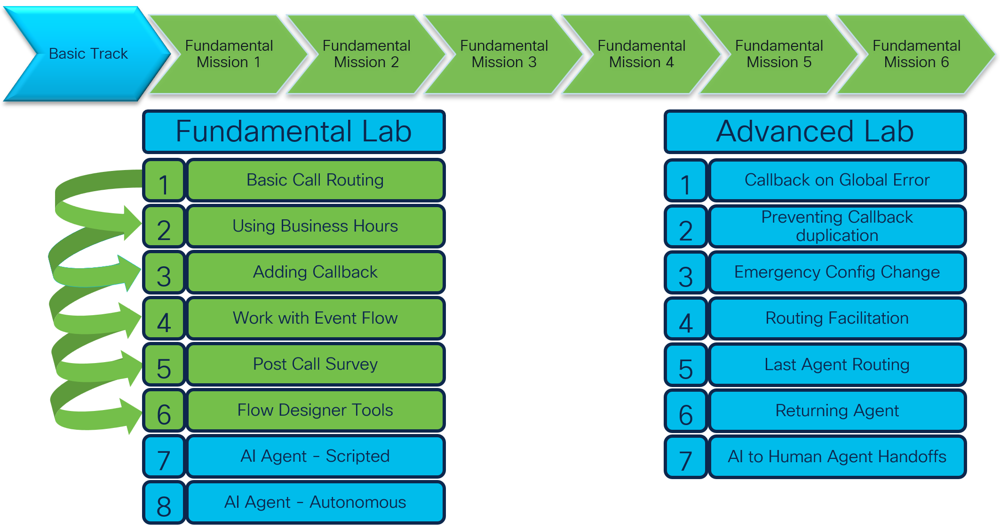
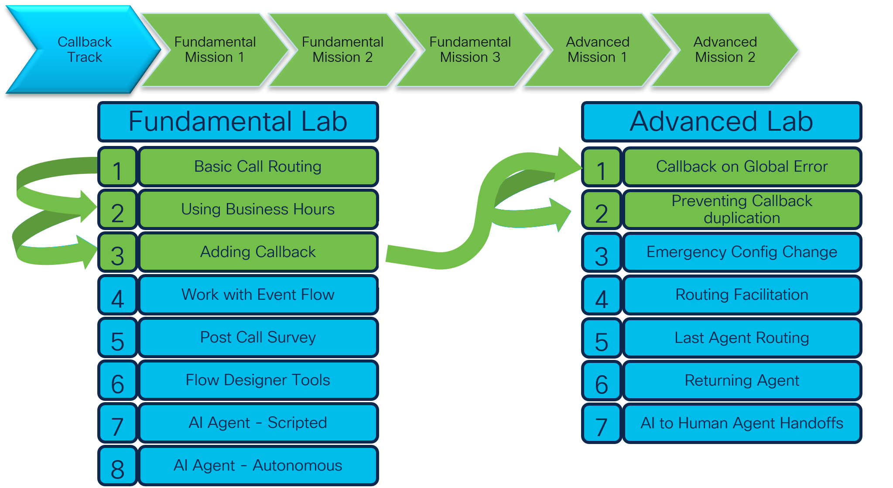

## Welcome to Your Lab Adventure!

### Overview
In this session, we’ve prepared 15 unique labs for you to explore. To make the experience more focused and exciting, we’ve grouped the labs into 4 tracks, each designed to help you master a specific set of skills.

Here’s what you need to know:

Each track includes different amount labs, tailored to guide you through a connected learning journey.
It is tottaly OK to complete any 1 track to meet the session's goals.
Feeling ambitious? Complete 2 tracks to excel, or tackle 3 tracks to become an expert. Want to go above and beyond? Conquer all 4 tracks to earn the title of Mega Superstar!
Take a moment to review the tracks, pick the one(s) that excite you most, and dive in. It’s your adventure—make it unforgettable!

Order is not important You can start from any track you feel interesting to you.

Here they are:

## Track 1: 

We will use the **Admin** profile first in the next section.

<script src='../template_assets/load.js'><script>