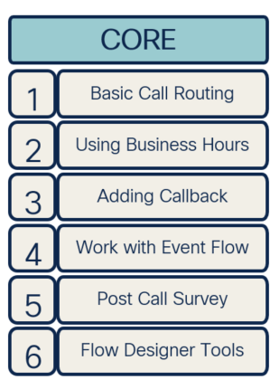
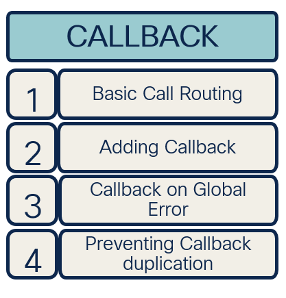
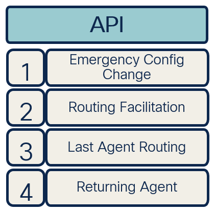
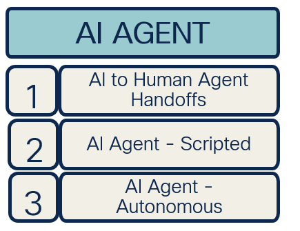

## Welcome Final Boss Fight Mission!

## Story
In this short troubleshooting task you're are going to play a technical engineer who got a request from end customer regarding broken production flow. You as an engineer must fix the reported issue before contact center opens in just 20 mins. So NO PRESSURE HERE AT ALL!!!

## **Problem Description** 
A customer reports a critical issue with their call flow: callers cannot land in the queue and are being redirected indefinitely. Initially, the problem seemed to be related to the queue configuration, but after the customer attempted some adjustments, the situation worsened. Now, callers cannot even reach the queue node, and it seems like they are stuck in a loop.

## Mission Details: 
Your task is to identify and fix the issues causing this behavior. Specifically:

1. Eliminate the loop so that calls can progress through the flow correctly.
2. Ensure that calls land in Queue_140 as intended. Customer requirement is to us dynamic variable instead of static queue name.
3. Configure the "Play Message" node to inform callers they are waiting in Queue_140 while in the queue .

## Track 1: Core Track

This track introduces the fundamental features of Flow Designer. Participants will explore flow templates, business hours, and event flows while learning to utilize additional tools like the Debugger and Analyzer.

## Track 2: CallBack Track

The Callback track includes a series of labs focused on various callback scenarios. It begins with basic callback configuration and progresses to advanced GraphQL techniques to eliminate duplicate callbacks.

## Track 3: API Track

In this track, participants will work on customizing flows using a variety of API requests to interact with different data sources.

## Track 4: AI Agent Track

Although the smallest, but challenging track. It involves configuring Cisco’s native AI agent (bot) and integrating it with Flow Designer to enable flow customization.

<script src='../template_assets/load.js'><script>