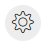

## Canvas, Main Flow, and Event Flows

The Canvas is the gray working space on which you drop the activities. Use the controls in the bottom left side of the screen to move around the canvas and zoom in and zoom out. There are no constraints on the flow size or canvas usage.

Flow Designer has two tabs that allow extra canvas space:
  - Main Flow
  - Event Flows

These tabs logically separate different paths of your flow and create a more organized workspace.

### Main Flow

Use the Main Flow tab to script the primary flow based on the Trigger Event defined in the Start Flow activity. In the Main Flow tab, configure the end-to-end experience for a caller, starting from the Cisco Unified IP Interactive Voice Response (IVR) menu, until opting out or wrapping up the call. The flow contains predictable steps that the system executes in a sequence.

### Event Flows

At any point during the execution of the Main Flow, the system triggers events that interrupt the Main Flow. For example, when an agent answers a phone call, the caller’s experience in the queue is interrupted. If you want to define unique behavior when these events are triggered, you can script optional Event Flows. Event Flows are asynchronous to the Main Flow. You can’t predict if or when an Event Flow will be triggered. For this reason, Event Flows are optional and are intended to extend the Main Flow functionality.

!!! Note
    You can configure multiple event handling flows in the Event Flows canvas. Each event flow must have a unique start and end, with no shared activities.

### Zoom Toolbar

The zoom toolbar in Flow Designer has **Global Properties**, zoom-in, and zoom-out buttons to display the Global Properties pane, and minimize or maximize the contents in the canvas.

  - Global Properties: Click the  icon to open the Global Properties pane.
  
  - Zoom-in: Click the icon on the toolbar. When you reach the maximum limit, the button is disabled.

  - Zoom-out: Click the icon on the toolbar. When you reach the maximum limit, the button is disabled.

  - Copy and paste activities: Click the icon on the toolbar to copy and paste selected activities on the canvas. For more information, see Copy and Paste Activities.

  - Undo:Click the Undo icon on the toolbar to undo the last performed action.

  - Redo: Click the Redo icon on the toolbar to redo the last performed action.

  - Arrange all: Click the Arrange All icon on the toolbar to organize all the activities in the flowdesigner canvas