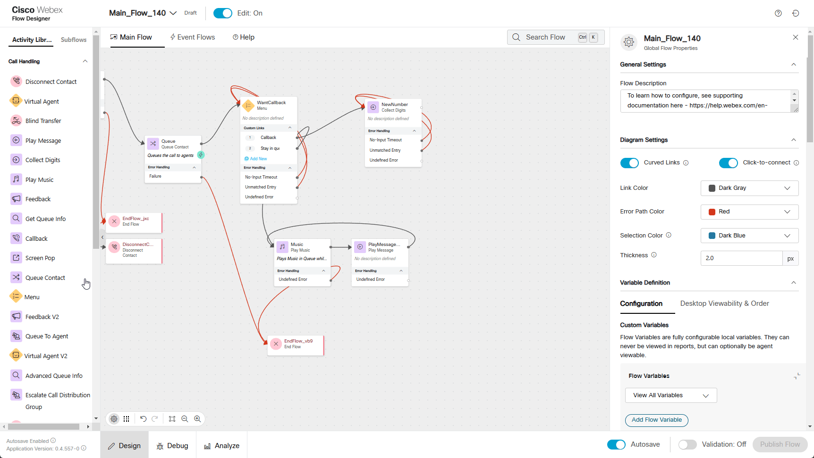

 Please **`submit the form below with your Attendee or pod ID`**. All configuration entries in the lab guide will be renamed to include your pod ID.
{: .block-warning }

<form id="attendee-form">
  <label for="attendee">Attendee ID:</label>
  <input type="text" id="attendee" name="attendee" onChange="update()"> 
 
  <button onclick="update()">Save</button>
</form>

 

### Story 

Callback functionality is an essential feature in a modern contact center, providing a solution that enhances both customer satisfaction and operational efficiency.

Imagine a customer calls a company’s sales line, interested in upgrading their service. The wait time is 20 minutes, but they’re in a busy store and can’t stay on hold. Instead, they request a callback.
Having a callback option is a must-have feature—it ensures businesses don’t lose potential leads while providing a seamless, customer-friendly experience.

### Build
We are going to extend the same flow by adding additional functionality so the caller would be offered with a callback later.

1. Open your flow **Main_Flow_<w class = "attendee_out">attendeeID</w>** and chanfe Edit mode to **On**
2. Delete  connection from **Queue** node to **Music** 
3. Drag **Menu** node:

    > Rename Activity Label to **WantCallback**
    >
    > Enable Text-To-Speech
    >
    > Select the Connector: Cisco Cloud Text-to-Speech
    >
    > Click the Add Text-to-Speech Message button and paste text: ***All agents are busy. Please press 1 if you want to schedule a callback. Press 2 if you want to wait in queue.***
    >
    > Delete the Selection for Audio File
    >
    > Under Custom Menu Links
    >
    >     - Change 0 to 1, add Link Description as **Callback** 
    >
    >     - Click Add New as 2 with  Link Description **Stay in queue**

    

4. Drag Collect Digits nodes
    Menu node:

    > Rename Activity Label to **NewNumber**
    >
    > Enable Text-To-Speech
    >
    > Select the Connector: Cisco Cloud Text-to-Speech
    >
    > Click the Add Text-to-Speech Message button and paste text: **Please enter your 11 digits phone number to which we should call you back.**
    >
    > Delete the Selection for Audio File
    >   
    > Advanced Settings
    >
    > No-Input Timeout  5 
    >
    > Make Prompt Interruptible: True
    >
    > Minimum Digits: 11
    >
    > Maximum Digits: 11
    >       
    > Connect **No-Input Timeout** to the front of the **NewNumber** node
    >
    > Connect Unmatched Entry to the front of the NewNumber node
    >   
    > Connect Callback from **WantCallback** node created in step 3 to **NewNumber** node
    >
    > Connect Stay in queue from **WantCallback** node created in step 3 to **Music** node

    

5. Drag one more Menu node
    
    > Rename Activity Label to **VerifyNumber**
    >
    > Enable Text-To-Speech
    >
    > Select the Connector: Cisco Cloud Text-to-Speech
    >
    > Click the Add Text-to-Speech Message button and paste text: **You entered** *{{NewNumber.DigitsEntered}}***. Press 1 if the number is correct. Press 2 if you want to re-enter the number.**
    >
    > Delete the Selection for Audio File
    >
    >    
    > Custom Menu Links
    >
    > Change 0 to 1, add Link Description as **Number OK**
    >
    > Click Add New as 2 with  Link Description **Number Not OK**
    >
    > Connect **No-Input Timeout** to the front of the **VerifyNumber** node
    >
    > Connect **Unmatched Entry** to the front of the **VerifyNumber** node
    >    
    > Connect **NewNumber** created in step 4 to **VerifyNumber** node
    >
    > Connect **Number Not OK** from **VerifyNumber** node created in step 5 to **VerifyNumber** node
    
    

6. Add **Callback** node
    
    > Callback Dial Number select5  ***NewNumber.DigitsEntered*** from dropdown list
    >    
    > Connect **Number OK** from **VerifyNumber** node created in step 5 to **CallBack** node

7. Add **PlayMessage** node as follows:
    
    > Enable Text-To-Speech
    >
    > Select the Connector: Cisco Cloud Text-to-Speech
    >
    > Click the Add Text-to-Speech Message button and paste text: You call has been successfully scheduled for a callback. Good Bye.
    >
    > Delete the Selection for Audio File
    >
    > Connect **CallBack** created in step 6 to **PlayMessage** node
    > Connect **PlayMessage** created in step 6 to **DisconnectCall** node
    
    [profiles](../graphics/Lab1/AM1-SetCallBack.gif!)

8. Validate the flow by clicking **Validate**, **Publish** and select the Latest version of the flow

    
###Testing
    
1. Make sure you re logged in as Agent and set status to Not Available. In this case call will not be assigned to an agent and call back will be proposed to a caller.
2. Make a call to your test number and if success you should hear configured messages and ask to provide a new number for a callback. Because in current lab we are having number limitations we are going to provide a wellknown Cisco Worldwide Support contact number **1 408 526 7209**
3. Once done another message about successful scheduling should play.
4. Make you agent Available. Contact Center will reserve you right away and propose to answer a callback call.

**Congratulations on completing another mission.**
