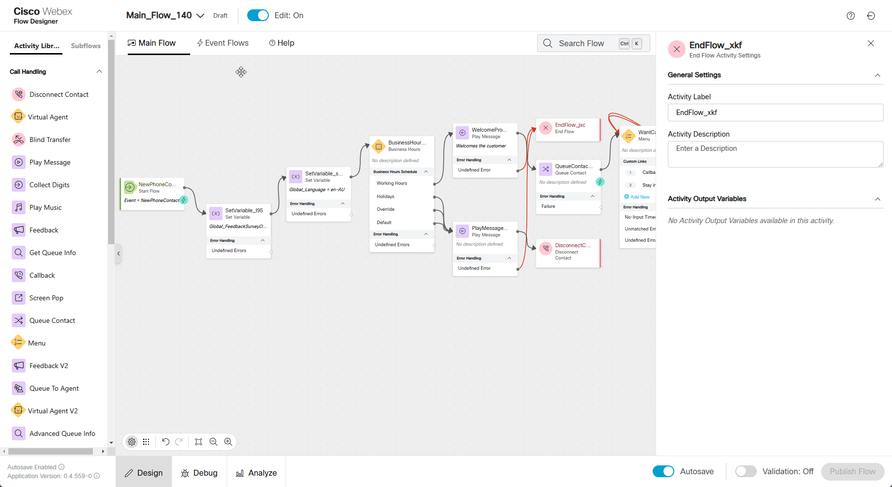

### Overview

In this lab, you will complete a mission to enhance customer feedback collection by integrating a survey into the Webex Contact Center call flow. The lab is designed to be simple yet practical, focusing on minimal configuration within the Flow Designer, while leveraging a preconfigured survey template.

> **

Good to Know [Optional]
**
> 
> Supported Survey Question Types in Webex Contact Center
> 
> 1. **Customer Satisfaction (CSAT)**:
>     - Purpose: Measure satisfaction with a specific interaction or service.
>     - Example Question: "On a scale of 1 to 5, how satisfied are you with the service you received today?"
>     - Use Case: Assess overall satisfaction at the end of a call or interaction.
> 2. **Customer Effort Score (CES)**:
>     - Purpose: Evaluate the ease of resolving a customer's issue or completing a task.
>     - Example Question: "On a scale of 1 to 5, how easy was it to complete your task today?"
>     - Use Case: Identify pain points in the customer journey or process efficiency.
> 3. **Net Promoter Score (NPS)**:
>     - Purpose: Measure customer loyalty and the likelihood of recommending the service.
>     - Example Question: "On a scale of 0 to 10, how likely are you to recommend our service to a friend or colleague?"
>   - Use Case: Gauge long-term customer loyalty and brand advocacy.
> 

### Mission Details

Your mission is to:

1. Integrate a preconfigured survey into the call flow using the Flow Designer.
2. Configure basic logic to determine when to route customers to the survey (e.g., after a call ends).
3. Understand how Webex Contact Center supports various survey question types, including CSAT, CES, and NPS.

The survey is prebuilt and includes key questions designed to gather actionable insights from customers. Your task is to focus on configuring the flow and ensuring the survey is triggered seamlessly during the customer journey.

### Pre-configured entities:        
     
> Survey: **PCS-2025**
>
> System defined GlobalVariable: **Global_FeedbackSurveyOptIn**. 
>

[Optional]
    In case you don't want to use pre-configured Survey you can configure your own. Expand below section to create your own Survey otherwise proceed to **Build** section below

> **

Create your own Survey [Optional]
**
> 
> - In **Control Hub -> Contact Center** open a **Survey** configuration page under **Customer Expirience**. Then click **Create new survey**.
> 
> - Enter survey name in **Survey name** field. Make sure **IVR survey** is selected. Then click next 
>
>     
>
> - Edit **Welcome note** and **Thank you note** by uploading the following files. Download files to your desktop prior uploading to survey. 
>
>     
>
> - Click on **Add a question** which is in the middle between **Welcome note** and **Thank you note**. Choose either NPS, CSAT or CES type of question.
> 
> - Upload respective audio prompts. Prompts can be downloaded from [shared folder](https://drive.google.com/drive/folders/1vS2aXgaCzorGAmGdQ7bP2NJMHNQx2ais?usp=sharing){:target="_blank"}.
> 
> - Click *Next**. You can ignore **Error Handling** configuration page. Click **Save**
> 
>     
> 

### Build
1. Explore preconfigured Survey. In Control Center go to **Contact Center**, then click **Survey** in Customer Expirience section on left hand side menu.    
  

2. Open you **Main_Flow_Your_Attendee_ID**, change Edit mode to **ON** and add Global Variable **Global_FeedbackSurveyOptIn** to your flow.
  

3. Drag **Set Variable** node to canvas:

    > Activity Name: **FeedbackSet**
    >
    > Variable: **Global_FeedbackSurveyOptIn**
    >
    > Set Value: **true**
    > 
    > Delete connection between **NewPhoneContact** and **SetVariable** on which we configured Language while doing the Main Lab.
    >
    > Connect **NewPhoneContact** to the front of the **NewNumber** node
    >
    > Connect **FeedbackSet** to the front of the **SetVariable** node

    

3. Open Event tab and locate **AgentDisconected** node. If you completed Mission 3 of Fundamental Lab you should have **HTTPRequest** node connected to it. Delete **EndFlow_xkf** that follows **HTTPRequest** node.

4. Drag **FeedbackV2**, **PlayMessage** and **DisconnectCall**
    
    **FeedbacV2**
    
    > SurveyMethod -> VoiceBased:  **PCS-2025**
    >        
    > Connect **HTTPRequest** to **FeedbackV2** node
    >
    > Connect **FeedbackV2** node to **Disconnect** node
    >
    > Connect **FeedbackV2** Undefined Error to **DisconnectCall** node
            
    **PlayMessage**
    
    > Enable Text-To-Speech
    >
    > Select the Connector: Cisco Cloud Text-to-Speech
    >
    > Click the Add Text-to-Speech Message button and paste text: ***Something went wrong on Feedback node. Please call later.***
    >
    > Delete the Selection for Audio File
    >
    > Connect **PlayMessage** created to **DisconnectCall** node
    >       

                

5. Validate the flow by clicking **Validate**, **Publish** and select the **Latest** version of the flow

### Testing
1. Your Agent desktop session should be still active but if not, use Webex CC Desktop application  and login with agent credentials you have been provided **wxcclabs+agent_IDYour_Attendee_ID@gmail.com** and become **Available** 
2. Make a test call and accept the call by Agent.
3. Finish the call by Agent so the caller could stay on the line. 
4. Now the caller should hear prompts configured in **PCS-2025**. Complete the survey.
5. To check Survey responses got to ***Control Hub -> Contact Center -> Surveys***. For **PCS-2025** click on Download and select Survey response period get a CSV file with provided answers.
    
    !!! Note
        If you create your own Survey as described in Optional section of this mission you might not see Survey response immediately as it has delay in edited surveys
        
**Congratulations on completing another mission where we have learnt how Post Call Survey can be implemented.**
