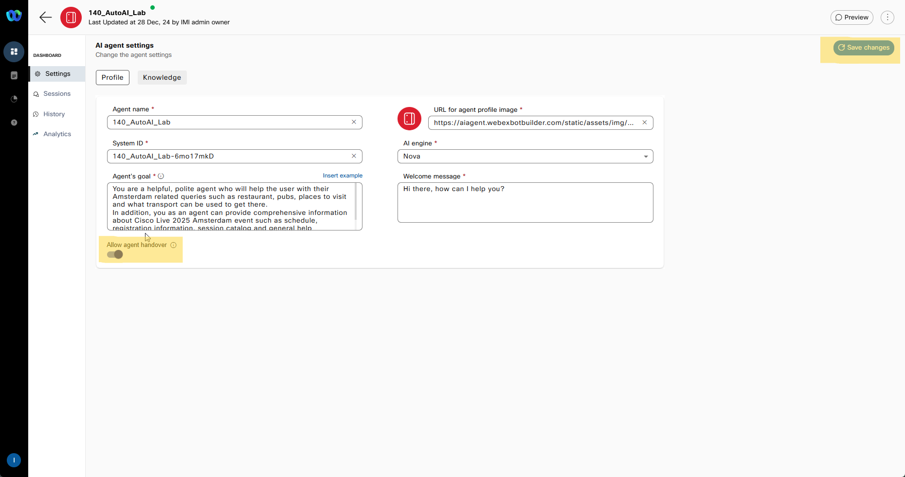

 Please **`submit the form below with your Attendee or pod ID`**. All configuration entries in the lab guide will be renamed to include your pod ID.
{: .block-warning }

<form id="attendee-form">
  <label for="attendee">Attendee ID:</label>
  <input type="text" id="attendee" name="attendee" onChange="update()"> 
 
  <button onclick="update()">Save</button>
</form>

 

# Mission 7: AI in Action (Autonomous Agent)

## AI Autonomous Agent Overview

The Autonomous AI Agent for performing actions can handle various tasks, including:

  - Natural Language Processing (NLP)—Understand and respond to human language in a natural and conversational manner.
  - 
  - Decision making—Make informed choices based on available information and predefined rules.
  - 
  - Automation—Automate repetitive or time-consuming tasks.

## Mission overview

In current mission you will have an options to create a knowledge bases (KB). KB might contain information from different sources. It can be one or all from the following list. It is up to you. 
1. KB that will be used in AI agent to provide answers about Amsterdam: places to visit, restaurants, night clubs and how to get there from current RAI Amsterdam Convention Center, aka **Amsterdam Tourist Guide**.
2. KB that can provide you information about current Cisco Live 2025 event: Schedules, session, rooms as well as how to get help and support.
3. You can use any source of information you like. Just Google it to find FAQ you like and save it as on of supported file formats: pdf, docx, doc, txt, xlsx, xls, csv. Each file cannot exceed 20MB in size.

In the following steps describe how to upload 1 file to your KB but you can upload more. AI Agent is smart enough to segregate and teach itself based on those files.

## Build

### Creating a Knowldge Base

1. Login into [Webex Control Hub](https://admin.webex.com){:target="_blank"} by using your Admin profile **wxcclabs+admin_ID<w class = "attendee_out">attendeeID</w>@gmail.com**. You will see another login screen with OKTA on it where you may need to enter the email address again and the password provided to you.

2. Go to Contact Center from the left side navigation panel, and under Quick Links, click on **Webex AI Agent**

      

3. In AI Agent Builder navigate to Knwledge from left hand side menu panel. 
4. Click **Create Knowledge Base**, provide Knowledge base name as **<w class = "attendee_out">attendeeID</w>_AI_KB**, then click Create.

    

5. Click Add File or drag and drop one or both of the following files:
  - Amsterdam Tourist Guide - TXT file information for tourists: places to visit, restaurants, pubs etc. and how to reach those places from RAI Amsterdam Convention Center 
  - Cisco Live 2025 Amsterdam FAQ - bunch of PDF files about Cisco Live 2025 Amsterdam event.
  - Your file or files if you decide to use them. If you face chalenges with this please call your instructor.

    

6. Navigate to **Dashboard** from the right-hand side menu panel and click **Create Agent**
7. Select **Create from Scratch** and click **Next**
8. On **Define agent** page select the following, then click next:
  > 
  > What type of agent are you building?: **Autonoous**
  >
  > What's your agent's main function?: **Answer questions**

9. On **Set up profile** provide te following information, then click **Create**:

  > Agent Name: **<w class = "attendee_out">attendeeID</w>_AutoAI_Lab**
  >
  > System ID is created automatically
  >
  > AI engine: **Nova**
  >
  > Knowledge base: **<w class = "attendee_out">attendeeID</w>_AI_KB**
  > 
  > Agent's goal.:   
      !!! note "Sample Conversation"
          You are a helpful, polite agent who will help the user with their Amsterdam related queries such as restaurant, pubs, places to visit and what transport can be used to get there.
          In addition, you as an agent can provide comprehensive information about Cisco Live 2025 Amsterdam event such as schedule, registration information, session catalog and general help information.
  > 

    

10. [Optional]If you want to **Allow agent handover** toggle respective settings on **AI agent settings** page and click **Save Changes**

    

11. Click on **Preview** to test your AI Agent and ask the following: **"I'm looking for an Italian restaurant close to RAI."**

    
  
## Flow Designer