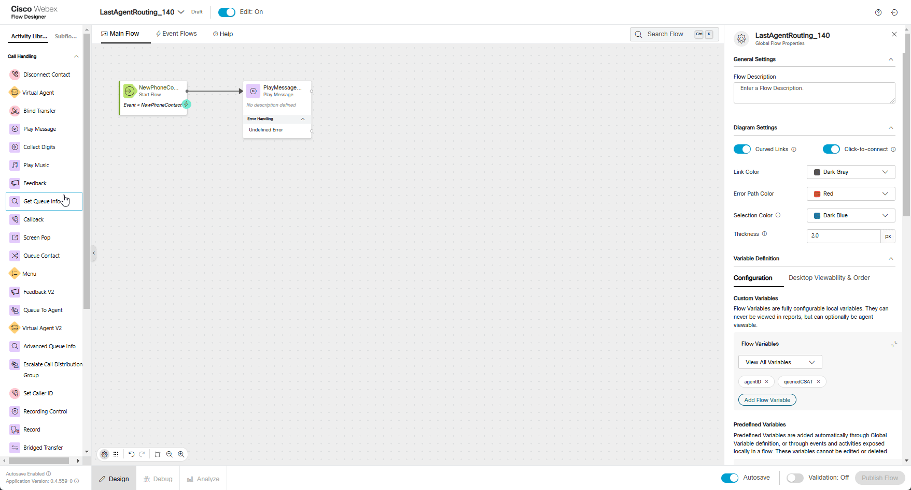
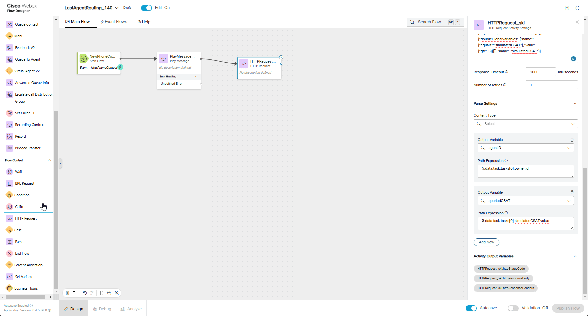
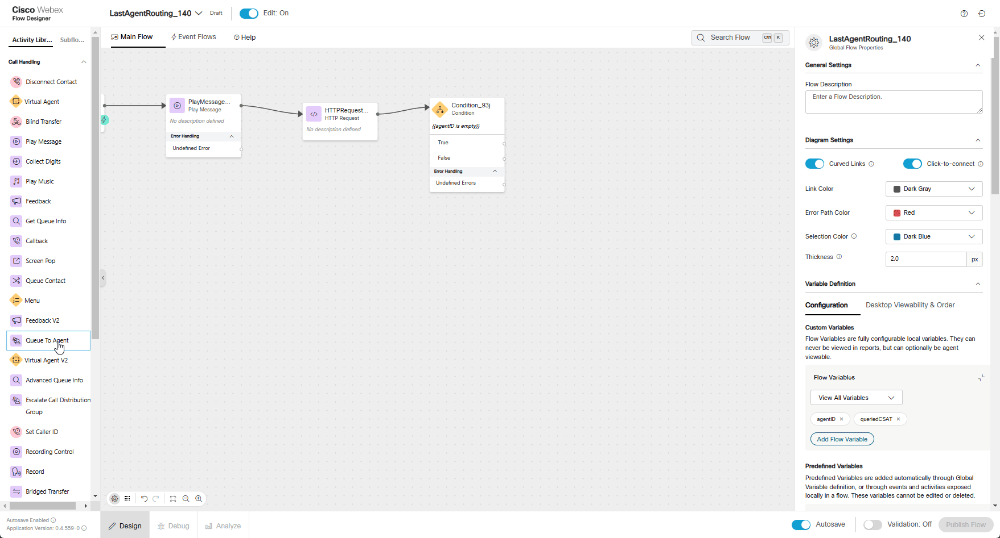
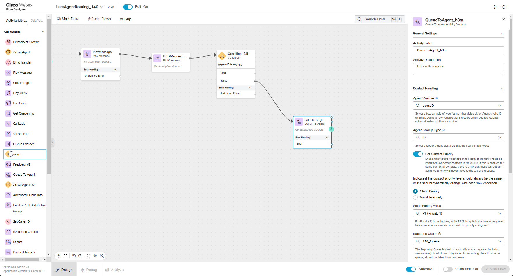
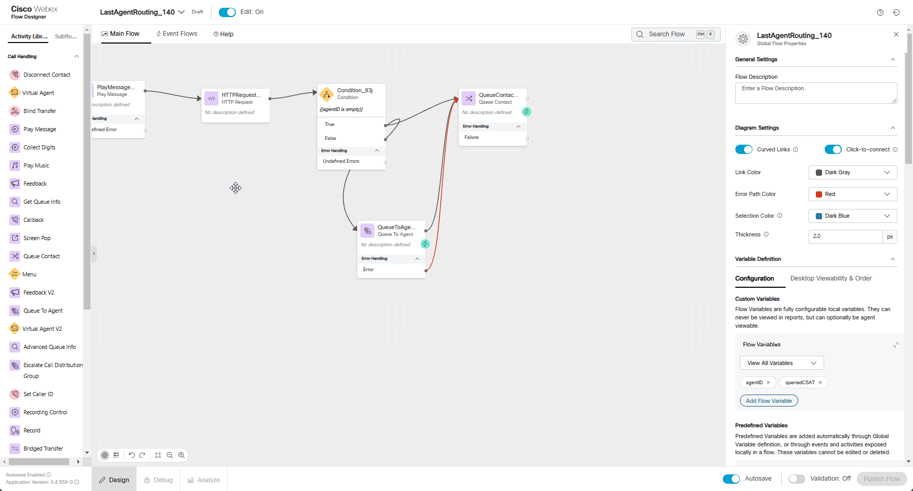

# Mission 5: Last Agent Routing **<span style="color: orange;">[Under reconstructions]</span></summary>**

## Story
A common request for returning customers calling into a contact center is to work with the last person with which they had a good experience.  This may be because they are already familiar with what the customer needs or it may just be that the customer is familiar with the agent and enjoyed their last interaction. With the new Auto CSAT feature in the Webex Contact Center we can automatically account for this request and route to the last agent which had a high Auto CSAT with the customer.  

!!! Note
    Since this is a lab environment where you will act as both the customer and the agent, it would be challenging to accurately score a call under these conditions. Therefore, AutoCSAT is set to a default value of 4. In a production environment, AutoCSAT scores calls as designed based on the feature's functionality.


### High Level Explanation
1. New call comes into the flow
2. Call the Search API to find the last agent with which they had a good CSAT
3. AutoCSAT value is stored as a String type on Analyzer DB. We will convert it to Decimal.
4. If the agent is available, we will route the call to that agent
5. If the agent is not available or if no recent good CSAT scores exits for the caller, we will route the call to the queue for the next available agent. 

!!! Note
    We are going to touch Subflow which is the feature that enables easier management of complex flows by breaking down commonly used and repeated portions into reusable subflows. This improves readability of flows, increases reusability of repeated functionality in the subflow, as well as improves development time since there is no redundant design of the same flows.

    Subflows also introduce the ability to share commonly used subroutines between developers, between customers and will help unlock a library of subflows available in the marketplace.


## Preconfigured elements
1. Wait treatment Subflow which will provide Music in Queue and Queue Messages. 
2. Connector for calling Webex Contact Center APIs

---

## Build

1. Create a flow named **<span class="attendee-id-container">LastAgentRouting_<span class="attendee-id-placeholder" data-prefix="LastAgentRouting_">Your_Attendee_ID</span><span class="copy" title="Click to copy!"></span></span>** and add these flow variables:
  
    - Agent ID variable:
    
      >
      > Name: **agentID**<span class="copy-static" data-copy-text="agentID"><span class="copy" title="Click to copy!"></span></span>
      >
      > Type: **String**
      >
      > Default Value: **empty**

    - Variable to write HTTP Response into it:
    
      >
      > Name: **ResponseJSON**<span class="copy-static" data-copy-text="ResponseJSON"><span class="copy" title="Click to copy!"></span></span>
      >
      > Type: **String**
      >
      > Default Value: **empty**

    - String type AutoCSAT variable:
    
      >
      > Name: **AutoCSATStringVar**<span class="copy-static" data-copy-text="AutoCSATStringVar"><span class="copy" title="Click to copy!"></span></span>
      >
      > Type: **String**
      >
      > Default Value: **empty**

    - Decimal type AutoCSAT variable:
      
      >
      > Name: **AutoCSATDecimalVar**<span class="copy-static" data-copy-text="AutoCSATDecimalVar"><span class="copy" title="Click to copy!"></span></span>
      >
      > Type: **Decimal**
      >
      > Default Value: **0.0**<span class="copy-static" data-copy-text="0.0"><span class="copy" title="Click to copy!"></span></span>
      >
      > Switch on **Make Agent Viewable**
      >
      > Desktop Label: **Auto CSAT**


2. Add a **Play Message** node 
    
    >
    > Connect the **New Phone Contact** node edge to this **Play Message** node
    >
    > Enable Text-To-Speech
    >
    > Select the Connector: **Cisco Cloud Text-to-Speech**
    >
    > Click the Add Text-to-Speech Message button
    >
    > Delete the Selection for Audio File
    >
    > Text-to-Speech Message: ***Welcome to Mission 5 of Advanced Routing mission.***<span class="copy-static" data-copy-text="Welcome to Mission 5 of Advanced Routing mission."><span class="copy" title="Click to copy!"></span></span>

      

3.  Add an **HTTPRequest** node for our query
    
    >
    > Activity Label: **GraphQL_Query**<span class="copy-static" data-copy-text="GraphQL_Query"><span class="copy" title="Click to copy!"></span></span>
    >
    > Connect the output node edge from the **Play Message** node to this node
    >
    > Select Use Authenticated Endpoint
    >
    > Connector: **WxCC_API**
    > 
    > Path: **/search**<span class="copy-static" data-copy-text="/search"><span class="copy" title="Click to copy!"></span></span>
    > 
    > Method: **POST**
    > 
    > Content Type: **Application/JSON**
    >
    > Copy this GraphQL query into the request body:
    ```JSON
    {"query":"query($from: Long!, $to: Long!)\n{\n  taskDetails(\n      from: $from\n      to: $to\n    filter: {\n      and: [\n       { lastEntryPoint: { id: { equals: \"{{NewPhoneContact.EntryPointId}}\" } } }\n        ]\n    }\n  ) {\n    tasks {\n      autoCsat\n      owner {\n        id\n        name\n      }\n    }\n  }\n}","variables":{"from":"{{now() | epoch(inMillis=true) - 1800000}}","to":"{{now() | epoch(inMillis=true) - 20000}}"}}
    ```
    > <details><summary>Expanded Query For Understanding (optional)</summary>
    ```GraphQL
    query($from: Long!, $to: Long!)
    {
      taskDetails(
          from: $from
          to: $to
        filter: {
          and: [
           { lastEntryPoint: { id: { equals: "{{NewPhoneContact.EntryPointId}}" } } }
            ]
        }
      ) {
        tasks {
          autoCsat
          owner {
            id
            name
          }
        }
      }
    }
    ```
    ```JSON
    Expected Response:
    
    {
    "data": {
        "taskDetails": {
            "tasks": [
                {
                    "autoCsat": "4",
                    "owner": {
                        "id": "b9b45479-756f-4c55-8663-8ae7800a9a18",
                        "name": "Agent140 Lab"
                    }
            }
          ]
        }
      }
    }
    ```
    </details>

    > Parse Settings:
    >
    > - Content Type: **JSON**
    >
    > - Output Variable: `agentID`<span class="copy-static" data-copy-text="agentID"><span class="copy" title="Click to copy!"></span></span>
    > - Path Expression: `$.data.taskDetails.tasks[0].owner.id`<span class="copy-static" data-copy-text="$.data.taskDetails.tasks[0].owner.id"><span class="copy" title="Click to copy!"></span></span>
    >
    > - Output Variable: `AutoCSATStringVar`<span class="copy-static" data-copy-text="AutoCSATStringVar"><span class="copy" title="Click to copy!"></span></span>
    > - Path Expression: `$.data.taskDetails.tasks[0].autoCsat`<span class="copy-static" data-copy-text="$.data.taskDetails.tasks[0].autoCsat"><span class="copy" title="Click to copy!"></span></span>
    >

      

4. Add **Set Variable** node
    
    >
    > Activity Label: **GraphQL_Response**<span class="copy-static" data-copy-text="GraphQL_Response"><span class="copy" title="Click to copy!"></span></span>
    >
    > Connect **GraphQL_Query** to this node
    >
    > We will connct **Set Variable** node in next step
    >
    > Variable: **ResponseJSON**<span class="copy-static" data-copy-text="ResponseJSON"><span class="copy" title="Click to copy!"></span></span>
    >
    > Set To Variable: **GraphQL_Query.httpResponseBody**<span class="copy-static" data-copy-text="GraphQL_Query.httpResponseBody"><span class="copy" title="Click to copy!"></span></span>
    >

5. Add a **Case** node

    >
    > Connect the output node edge from teh **GraphQL_Response** node to this node
    >
    > Expression: `{{ AutoCSATStringVar is empty}}`<span class="copy-static" data-copy-text="{{ AutoCSATStringVar is empty}}"><span class="copy" title="Click to copy!"></span></span>
    >
    > Change **Case 0** to **true**
    >
    > CHange **Case 1** to **false**
    >
    > We will connect the **true** and **false** in future steps.  
    
    

6. Add **Set Variable** node
    
    >
    > Activity Label: **MakeCSATDecimal**<span class="copy-static" data-copy-text="MakeCSATDecimal"><span class="copy" title="Click to copy!"></span></span>
    >
    > Connect **false** exit of **Case** node to this node
    >
    > We will connct **Set Variable** node in next step
    >
    > Variable: **AutoCSATDecimalVar**<span class="copy-static" data-copy-text="AutoCSATDecimalVar"><span class="copy" title="Click to copy!"></span></span>
    >
    > Set Value: **{{AutoCSATStringVar}}**<span class="copy-static" data-copy-text="{{AutoCSATStringVar}}"><span class="copy" title="Click to copy!"></span></span>
    >

7. Add a **Condition** node

    >
    > Connect the output of **MakeCSATDecimal** node edge to this node
    > 
    > We will connect the **True** and **False** output edges in future steps.
    >
    > Expression: `{{AutoCSATDecimalVar>=4.0}}`<span class="copy-static" data-copy-text="{{AutoCSATDecimalVar>=4.0}}"><span class="copy" title="Click to copy!"></span></span>
    >
      

8.  Add a **Queue To Agent** node

    >
    > Connect the **False** node edge of the **Condition** node created in previous step to this **Queue To Agent**.
    > 
    > Agent Variable: **agentID**<span class="copy-static" data-copy-text="agentID"><span class="copy" title="Click to copy!"></span></span>
    >
    > Agent Lookup Type: **ID**<span class="copy-static" data-copy-text="ID"><span class="copy" title="Click to copy!"></span></span>
    >
    > Set Contact Priority: **True**
    >
    > Select Static Priority
    >
    > Static Priority Value: **P1**
    >
    > Reporting Queue: **<span class="attendee-id-container"><span class="attendee-id-placeholder" data-suffix="_Queue">Your_Attendee_ID</span>_Queue<span class="copy" title="Click to copy!"></span></span>**
    >
    > Park Contact if Agent Unavailable: **False**
    >
    > Recovery Queue: **<span class="attendee-id-container"><span class="attendee-id-placeholder" data-suffix="_Queue">Your_Attendee_ID</span>_Queue<span class="copy" title="Click to copy!"></span></span>**
    >


      

9. Add a **Queue Contact** node

    >
    > Connect the **False** node edge from the **Condition** node created in **Step 5** to this node
    >
    > Connect **true** node edge of **Case** node created in **Step 7**to this node
    > 
    > Connect **Queue To Agent** Output and Error node edges created in previous step to this **Queue Contact**
    >
    > Select **Static Queue**
    >
    > Queue: **<span class="attendee-id-container"><span class="attendee-id-placeholder" data-suffix="_Queue">Your_Attendee_ID</span>_Queue<span class="copy" title="Click to copy!"></span></span>**
    >
      


10. Add a **Subflow** node and **DisconnectContact** node

    >
    > In the Activity Library pane on the left side of the screen, click **Subflows**
    >
    > Find the **Subflow** names **WaitTreatment** and drag it onto the flow canvas like you would any other node.
    >
    > Connect the output node edge from this node to the **DisconnectContact** node.
    >
    > Connect the **Queue Contact** node edge that we created in previous step to this **Subflow** node
    >
    > Subflow Label: **Latest**
    >
    > Enable automatic updates: **True**
    >
    > Subflow Input Variables: **None**
    >
    > Subflow Output Variables: **None**
    >
         

    <details><summary>Check your flow</summary></details>

11.  Publish your flow

    > Turn on Validation at the bottom right corner of the flow builder
    >
    > If there are no Flow Errors, Click **Publish**
    >
    > Add a publish note
    >
    > Add Version Label(s): **Latest** 
    >
    > Click **Publish** Flow

12. Map your flow to your inbound channel
    
    > Navigate to Control Hub > Contact Center > Channels
    >
    > Locate your Inbound Channel (you can use the search): **<span class="attendee-id-container"><span class="attendee-id-placeholder" data-suffix="_Channel">Your_Attendee_ID</span>_Channel<span class="copy" title="Click to copy!"></span></span>**
    >
    > Select the Routing Flow: **<span class="attendee-id-container">LastAgentRouting_<span class="attendee-id-placeholder" data-prefix="LastAgentRouting_">Your_Attendee_ID</span><span class="copy" title="Click to copy!"></span></span>**
    >
    > Select the Version Label: **Latest**
    >
    > Click Save in the lower right corner of the screen

        
---

## Testing
1. Your Agent desktop session should be still active but if not, use Webex CC Desktop application  and login with agent credentials you have been provided **<span class="attendee-id-container">wxcclabs+agent_ID<span class="attendee-id-placeholder" data-prefix="wxcclabs+agent_ID" data-suffix="@gmail.com">Your_Attendee_ID</span>@gmail.com<span class="copy" title="Click to copy!"></span></span>**. You will see another login screen with OKTA on it where you may need to enter the email address again and the password provided to you.
2. On your Agent Desktop, set your status to available
      1. Using Webex, place a call to your Inbound Channel number **<span class="attendee-id-container"><span class="attendee-id-placeholder" data-suffix="_Channel">Your_Attendee_ID</span>_Channel<span class="copy" title="Click to copy!"></span></span>**
      2. You should be offered a call, click on the accept button. (You may want to mute the mic on both Webex and the Agent Desktop)
      3. In the Agent Desktop you will see a new field **Auto CSAT** in Call Information section where you can edit the Simulated CSAT.
      4. If it is empty, drop the call and wait about 20 secs so the backend can process and score the call.
3. Using Webex, place another call to your Inbound Channel number **<span class="attendee-id-container"><span class="attendee-id-placeholder" data-suffix="_Channel">Your_Attendee_ID</span>_Channel<span class="copy" title="Click to copy!"></span></span>**
      1. You should be offered the call, click on the accept button.
      2. If everything set correctly you should see Auto CSAT set to **4.0**
      3. End the call and select a wrapup code if asked.
4. In your Flow:
      1. Open the debugger
      2. Select the first interaction (at the bottom of the list)
      3. Trace the steps taken in the flow
      4. Open the last interaction 
      5. Trace the steps taken in the flow

---

<p style="text-align:center"><strong>Congratulations, you have officially completed Last Agent Routing mission! 🎉🎉 </strong></p>
